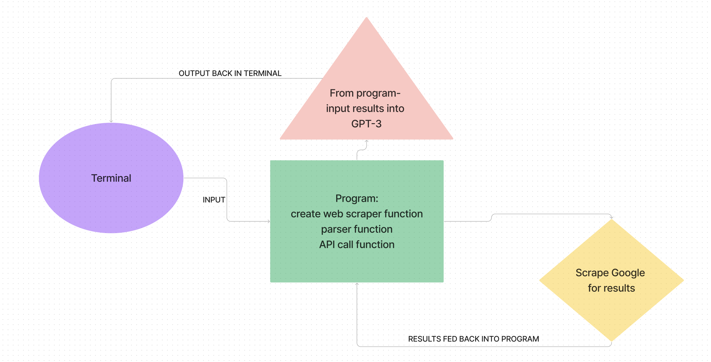

# Authors
### Aubrey Corsetti
### Angelos Kounavis
### Matthew Gebhart
### Erik Dodd

# Name of Project: Dev_B.F.F.

## Team Name

Cobra Kai

## Description of Project
Web scraper application that finds articles about Python to feed through GPT3 to give us a simple explanation about a topic

### Trello

User stories are [HERE](https://trello.com/invite/devbff/ATTI2d0404d73d0e6086f7f0e41ed8e08e1c1E264344)

### Whiteboard

### Domain Model

### Setup
.venv virtual environment running python 3.11
- required installs: 
- python-dotenv
- openai